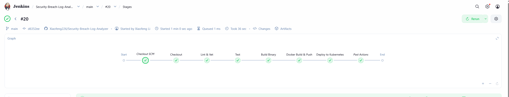
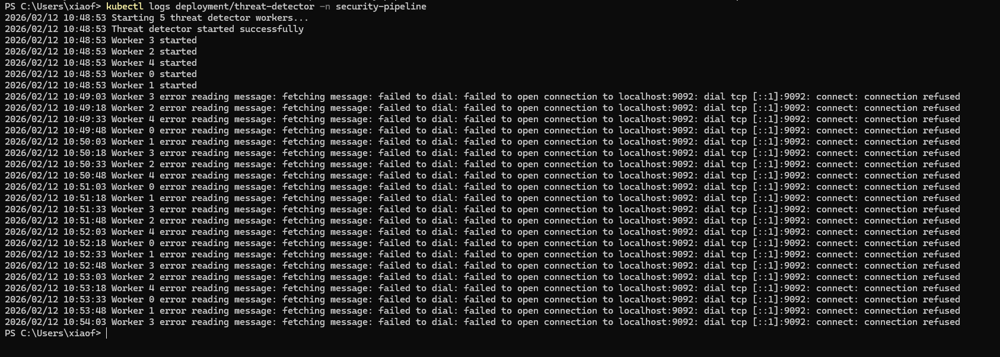
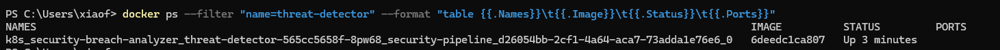

# Distributed Security Event Pipeline

**Real-time threat detection microservice built with Go, Kafka, Redis, and Kubernetes**

[](https://www.jenkins.io/)
[](https://golang.org/)
[](https://kafka.apache.org/)
[](https://kubernetes.io/)
[](https://www.docker.com/)
[](https://hub.docker.com/r/lixiaolongbao/security-breach-analyzer)

## Overview

A cloud-native threat detection microservice that consumes security events from Apache Kafka, analyzes them in real time using Go concurrency primitives, and tracks threat state with Redis sliding-window counters. Deployed on Kubernetes via a fully automated Jenkins CI/CD pipeline.

Inspired by the architecture of modern EDR platforms like CrowdStrike Falcon — event ingestion, behavioral analysis, and alert publishing in a stateless, horizontally scalable service.

## Demo

### CI/CD Pipeline (Jenkins — 6 Stages)


### Real-time Threat Detection (Pod Logs)


### Deployed Container (Kubernetes on Docker Desktop)


## Architecture

```
┌─────────────────────────────────────┐
│          Kafka Topic                 │
│       "security-events"              │
│  (auth logs, syslog, app events)     │
└────────────────┬────────────────────┘
                 │  Consumer Group:
                 │  threat-detector-group
        ┌────────┴────────┐
        │                 │
   Worker 0..4      (5 goroutines)
        │
        ▼
┌─────────────────────────────────────┐
│         Threat Detection Logic       │
│                                      │
│  ┌─────────────────────────────┐    │
│  │  Brute Force Detector        │    │
│  │  • Redis sliding window      │    │
│  │  • 5 failed auth / 5 min     │    │
│  └─────────────────────────────┘    │
│  ┌─────────────────────────────┐    │
│  │  Privilege Escalation        │    │
│  │  • sudo / sensitive files    │    │
│  │  • /etc/shadow, useradd...   │    │
│  └─────────────────────────────┘    │
│  ┌─────────────────────────────┐    │
│  │  Suspicious User Activity    │    │
│  │  • "invalid user" pattern    │    │
│  │  • 3 invalid users / 5 min   │    │
│  └─────────────────────────────┘    │
└────────────────┬────────────────────┘
                 │
                 ▼
┌─────────────────────────────────────┐
│       Redis (State Store)            │
│  failed_auth:<ip>  → count, TTL     │
│  invalid_user:<ip> → count, TTL     │
└─────────────────────────────────────┘
                 │
                 ▼
┌─────────────────────────────────────┐
│          Kafka Topic                 │
│        "security-alerts"             │
│  (JSON: severity, type, IP, detail) │
└─────────────────────────────────────┘
```

All components run as a single stateless binary deployed on Kubernetes — horizontally scalable by increasing replica count.

## CI/CD Pipeline

6-stage Jenkins Multibranch Pipeline that runs on every push to `main`:

| Stage | What it does |
|-------|-------------|
| **Checkout** | Clones repo from GitHub |
| **Lint & Vet** | Runs `go vet ./...` to catch common bugs |
| **Test** | Runs `go test` with coverage report, archives as artifact |
| **Build Binary** | Compiles static Linux binary with version embedded in ldflags |
| **Docker Build & Push** | Multi-stage Docker build, pushes `sha-<commit>` and `latest` tags to Docker Hub |
| **Deploy to Kubernetes** | Idempotent kubectl apply, rolling update, 120s rollout health check, auto-rollback on failure |

Pipeline uses a Secret File credential for kubeconfig injection — Jenkins writes it to a secure temp path and passes it directly to `KUBECONFIG`, avoiding string escaping issues.

## Key Implementation Details

### Concurrent Event Processing
```go
func (td *ThreatDetector) Start(numWorkers int) {
    for i := 0; i < numWorkers; i++ {
        td.wg.Add(1)
        go td.processEvents(i)   // 5 parallel Kafka consumers
    }
    td.wg.Add(1)
    go td.publishAlerts()        // async alert publisher
}
```

### Redis Sliding-Window Rate Limiting
```go
func (td *ThreatDetector) isBruteForce(event SecurityEvent) bool {
    if event.EventType != "authentication" || event.Result != "failed" {
        return false
    }
    key := fmt.Sprintf("failed_auth:%s", event.SourceIP)
    count, _ := td.redisClient.Incr(td.ctx, key).Result()
    td.redisClient.Expire(td.ctx, key, 5*time.Minute)
    return count >= 5  // 5 failures in 5 minutes = brute force
}
```

### Threat Alert Schema
```go
type ThreatAlert struct {
    AlertID    string    `json:"alert_id"`
    Timestamp  time.Time `json:"timestamp"`
    Severity   string    `json:"severity"`    // HIGH, MEDIUM, LOW
    ThreatType string    `json:"threat_type"` // BRUTE_FORCE, PRIVILEGE_ESCALATION, SUSPICIOUS_USER
    SourceIP   string    `json:"source_ip"`
    Details    string    `json:"details"`
    EventCount int       `json:"event_count"`
}
```

### Graceful Shutdown
```go
sigChan := make(chan os.Signal, 1)
signal.Notify(sigChan, os.Interrupt, syscall.SIGTERM)
<-sigChan
detector.Shutdown()  // closes channels, flushes Kafka, waits on WaitGroup
```

## Technology Stack

| Component | Technology | Purpose |
|-----------|-----------|---------|
| **Language** | Go 1.21 | Concurrent event processing |
| **Message Queue** | Apache Kafka | `security-events` → `security-alerts` pipeline |
| **Cache / State** | Redis 7.0+ | Sliding-window threat counters with TTL |
| **Orchestration** | Kubernetes 1.30 | Deployment, namespace isolation, rolling updates |
| **Containerization** | Docker (multi-stage) | Alpine runtime image, stripped binary |
| **CI/CD** | Jenkins Multibranch Pipeline | 6-stage automated build, test, deploy |
| **Registry** | Docker Hub | `lixiaolongbao/security-breach-analyzer` |

## Project Structure

```
.
├── securityBreach.go   # Threat detector service (main entry point)
├── Dockerfile          # Multi-stage build: golang:1.21-alpine → alpine:3.18
├── Jenkinsfile         # 6-stage CI/CD pipeline
├── go.mod              # Module: github.com/Xiaofeng226/Security-Breach-Log-Analyzer
├── go.sum
├── screenshots/
│   ├── jenkins-pipeline.png
│   ├── threat-detection.png
│   └── docker-services.png
└── README.md
```

## Detected Threat Types

| Threat | Detection Logic | Severity |
|--------|----------------|----------|
| **Brute Force** | ≥5 failed `authentication` events from same IP within 5 min (Redis counter) | HIGH |
| **Privilege Escalation** | `sudo` action + sensitive target (`/etc/shadow`, `/etc/passwd`, `useradd`, `chmod 777`) | MEDIUM |
| **Suspicious User** | ≥3 `invalid user` patterns from same IP within 5 min (Redis counter) | HIGH |

## Kubernetes Deployment

```bash
# View running pods
kubectl get pods -n security-pipeline

# Stream threat detection logs
kubectl logs -f deployment/threat-detector -n security-pipeline

# Scale workers (each replica runs 5 goroutines)
kubectl scale deployment threat-detector --replicas=3 -n security-pipeline

# Trigger manual rollback
kubectl rollout undo deployment/threat-detector -n security-pipeline
```

## Docker Image

```bash
# Pull and run locally (requires Kafka + Redis on localhost)
docker pull lixiaolongbao/security-breach-analyzer:latest
docker run lixiaolongbao/security-breach-analyzer:latest
```

Multi-stage Dockerfile: Go builder compiles a fully static binary (`CGO_ENABLED=0`), copied into a minimal `alpine:3.18` runtime image.

## Roadmap

- [x] Kafka consumer group with concurrent goroutine workers
- [x] Redis sliding-window counters for brute force and suspicious user detection
- [x] Privilege escalation detection via log pattern matching
- [x] Alert publishing to `security-alerts` Kafka topic
- [x] Graceful shutdown (signal handling, WaitGroup drain)
- [x] Multi-stage Docker build and Docker Hub publish
- [x] Kubernetes deployment with rolling updates and auto-rollback
- [x] 6-stage Jenkins CI/CD pipeline with coverage reporting
- [ ] ConfigMap-driven Kafka broker and Redis configuration
- [ ] Machine learning-based anomaly detection
- [ ] Prometheus metrics endpoint (`/metrics`)
- [ ] Helm chart for parameterized deployment

## Inspiration

Built to understand the core event-processing architecture behind modern EDR platforms:
- **CrowdStrike Falcon** — cloud-native behavioral analytics
- **Elastic Security** — event streaming and correlation at scale
- **Splunk** — real-time log aggregation and alerting

## Author

Xiaofeng Li — [xiali@g.hmc.edu](mailto:xiali@g.hmc.edu)

## License

MIT License
